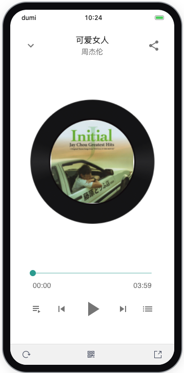
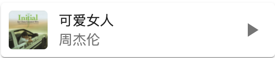

# 🏠 material-music-player

 

> A beautiful music player with Material Design.

## 💿 Demo






## 👩🏻‍💻 Install

```bash
$ npm install material-music-player
# or
$ yarn add material-music-player
```

## 📖 Documentation

You can find the documentation on these website：

1. [Deployment on GitHub Pages.](https://normalhamal.github.io/material-music-player/)
2. [Deployment on Vercel.](https://material-music-player.vercel.app/)

Click the Getting Started Button into a usage guide.
